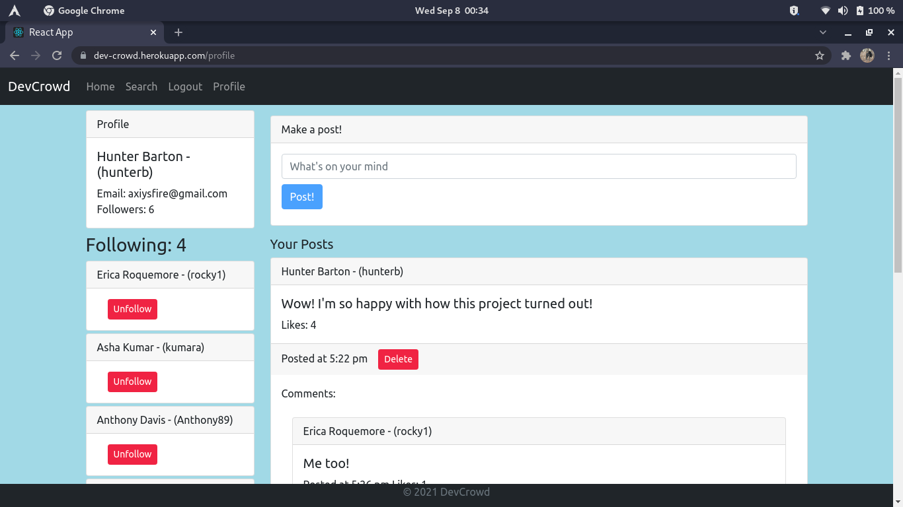

# Dev Crowd

### Project Created By: Hunter Barton, Asha Kumar, Erica Roquemore, Valentin Garcia, and Anthony Davis.

## **Description**

An app where developers can connect. Created with React, MongoDB, GraphQL, and Bootstrap.

---

## **Table of Contents**

-  [Installation](#installation)
-  [Usage](#usage)
-  [License](#license)
-  [Contributing](#contributing)
-  [Tests](#tests)
-  [Questions](#questions)

---

## Installation

First run `npm i` to install the client and the server, then run `npm run develop` to start a dev server.

## Usage

First create an account then you can create, like, and comment on posts.

## Screenshots

## Technologies Used

---

-  React
-  Node
-  GraphQL
-  MongoDB
-  Bootstrap
-  Apollo

---

## Contributing

Create a pull request for review
If you would like to add to this project, you can [follow me on GitHub](https://github.com/mythosmystery).

## Tests

## Questions:

If you have any questions about this project, you can reach me [on GitHub](https://github.com/mythosmystery)
or via email at axiysfire@gmail.com.

## License

MIT

**Dev Crowd created 07-29-21, by Hunter Barton.**
